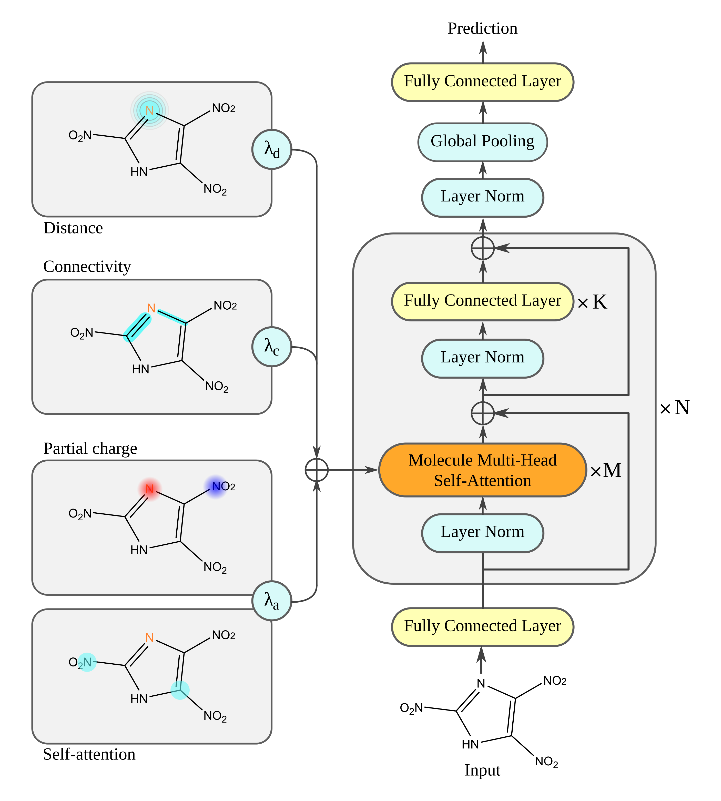

# Sensitivity Prediction of Energetic Materials using Machine Learning
This repo contains the implementation of my FYP project, mainly centered on the adaptation of the Molecule Attention Transformer ([ArXiv](https://arxiv.org/abs/2002.08264)) to energetic materials. This new model is named MATCh, representing the inclusion of partial charges of atoms for a more comprehensive molecule representation. 

## Code
- `cv.py` used for cross-validation
- `tune.py` used for hyperparameter optimisation using [Ray Tune](https://docs.ray.io/en/ray-0.4.0/tune.html)
- `src/transformer.py` file with MAT class implementation, directly from the [MAT repo](https://github.com/ardigen/MAT)
- `src/utils.py` file with utils functions
- `src/featurization/data_utils.py` file which contains molecule specific featurisations to this problem. 

## Requirements
- Python 3.6
- PyTorch 1.9
- RDKit 2019.03.2
